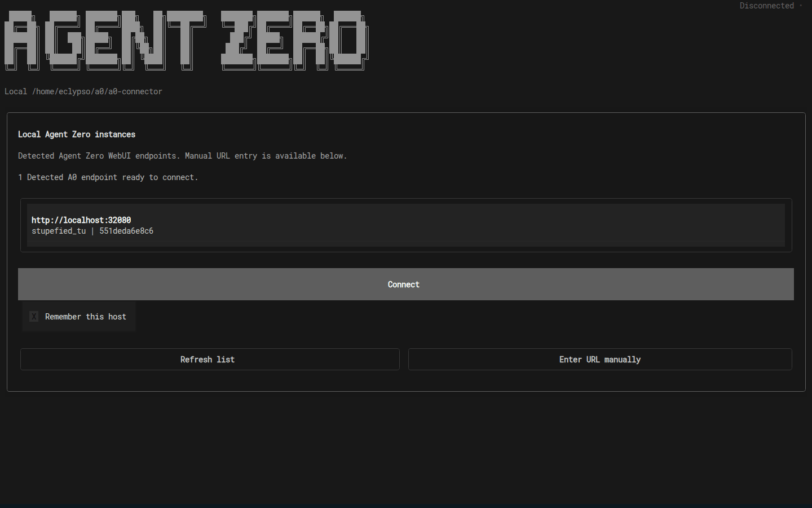
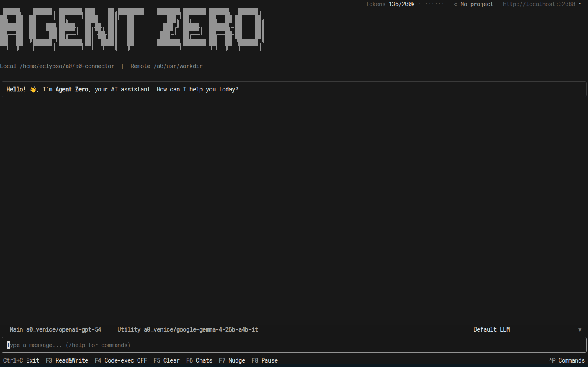
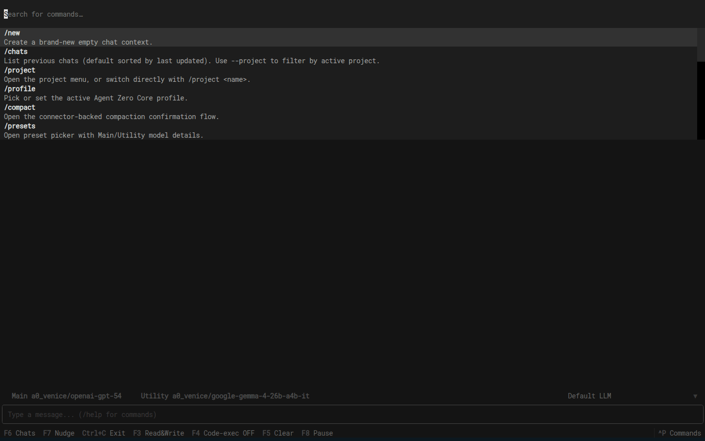
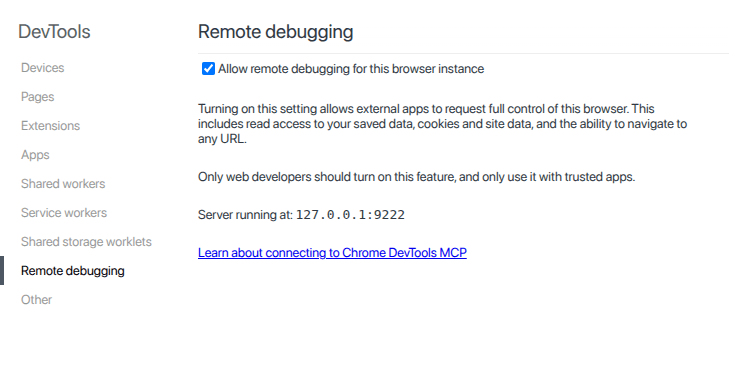
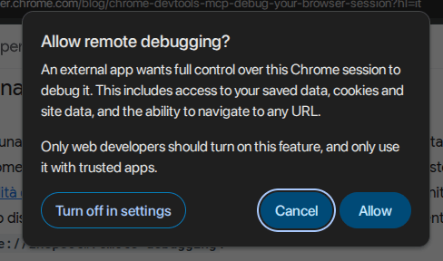
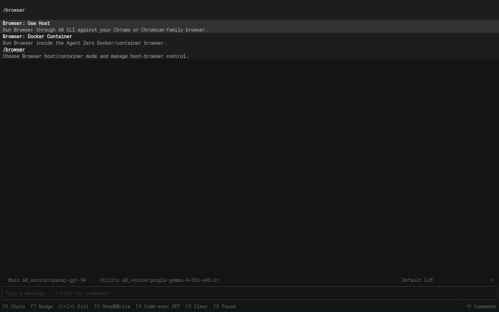
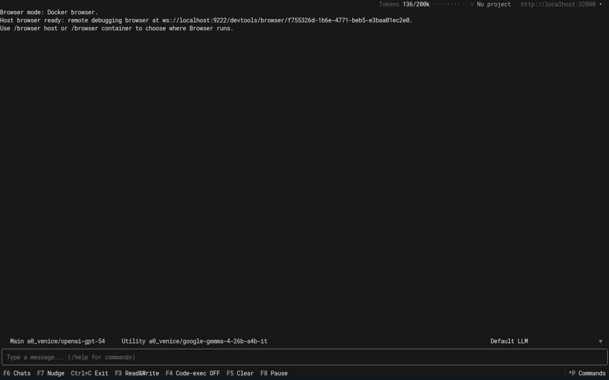
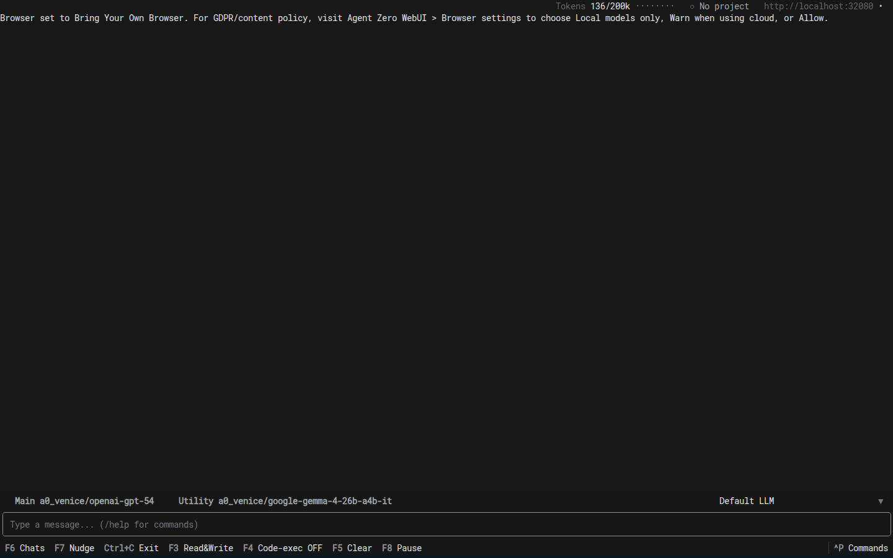
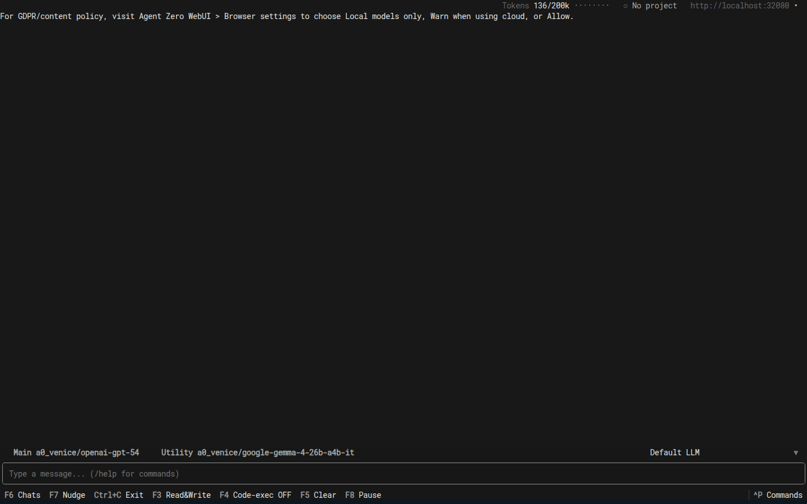

# A0 CLI Connector

A0 CLI connects your terminal to Agent Zero.

It is not a second agent. Agent Zero is still the one thinking, remembering, and
using tools. A0 CLI is the doorway that lets Agent Zero work on the computer
where the CLI is running.

Agent Zero lives in Docker because that is safer and easier to manage. A0 CLI is
the intentional bridge for moments when you want Agent Zero to work with your
real files, terminal, or browser on the host machine.

Agent Zero stays in Docker. A0 CLI installs on the host machine.

The same connector can also let Agent Zero use a Chrome-family browser on your
computer.

## Quick Install

**macOS / Linux:**
```bash
curl -LsSf https://cli.agent-zero.ai/install.sh | sh
```

**Windows (PowerShell):**
```powershell
irm https://cli.agent-zero.ai/install.ps1 | iex
```

Run these on the host machine, not inside the Agent Zero container.

The installer handles the small Python helper it needs.

## Open it and start working

1. Make sure Agent Zero is already running.
2. Launch A0 CLI on the host machine:

```bash
a0
```

3. If Agent Zero is running on the same machine, A0 CLI will usually find it.
4. If Agent Zero is somewhere else, enter its web address.
5. Open or create a chat and confirm you can talk to Agent Zero from the host machine.

> [!NOTE]
> If A0 CLI says connector support is missing, update Agent Zero first.

### Connection picker

On launch, A0 CLI opens a host picker. If it finds Agent Zero on this machine,
click **Connect**. If Agent Zero is somewhere else, click **Enter URL manually**
and paste the address.



Useful launch options:

```bash
a0 --host http://localhost:32080
a0 --no-auto-connect
a0 --no-docker-discovery
```

You can also set the address before launching:

```bash
export AGENT_ZERO_HOST=http://localhost:32080
a0
```

If **Remember this host** is enabled, the CLI saves that address for next time.

### The connected shell

After connecting, the shell shows the Agent Zero address, current project, model,
local folder, Agent Zero workspace, and the message box.



Use the footer when your terminal supports function keys:

| Key | Action |
|---|---|
| `F3` | Toggle host file read/write access for the active CLI session. |
| `F4` | Toggle remote code execution through the active CLI session. |
| `F5` | Clear the visible chat log. |
| `F6` | Open the chat list. |
| `F7` | Nudge the active agent run. |
| `F8` | Pause the active agent run. |
| `Ctrl+C` | Exit. |
| `Ctrl+P` | Open the command palette. |

`Ctrl+P` is the best fallback when an IDE terminal or SSH client captures
function keys.



### Slash commands

Type a slash command in the message box and press Enter. Most commands are also
available from `Ctrl+P`.

| Command | Use it for |
|---|---|
| `/new` | Create a new empty chat. |
| `/chats` | List previous chats. Add `--project`, `--all-projects`, or `--sort=updated|created|name` when needed. |
| `/project` | Open the project menu, or switch directly with `/project <name>`. |
| `/profile` | Pick or set the active Agent Zero Core profile. |
| `/compact` | Compact the current chat after confirmation. |
| `/pause` | Pause the active run. |
| `/resume` | Resume a paused run. |
| `/nudge` | Nudge the active run. |
| `/presets` | Choose a model preset. |
| `/models` | Edit the active models. |
| `/browser` | Check or change Browser mode. |
| `/attach` | Attach local image files to the next message. Aliases: `/image`, `/img`. |
| `/keys` | Show or hide key and widget help. |
| `/disconnect` | Disconnect and return to the host connection flow. |
| `/help` | Print the available command list in the shell. |
| `/quit` | Disconnect and exit the CLI. |

## Host Browser

Use this when you want Agent Zero to browse with a browser on your computer.
This is useful when the page, login, or browser profile should stay on your
machine.

### Setup Checklist

- [ ] Keep A0 CLI connected to the Agent Zero chat.
- [ ] In Agent Zero Web UI, open Browser plugin settings and choose **Bring Your
      Own Browser**.
- [ ] If you want Agent Zero to use an already-open personal Chrome window, open
      that browser first.
- [ ] In that browser, go to `chrome://inspect/#remote-debugging`.
- [ ] Enable **Allow remote debugging for this browser instance**.



When Agent Zero performs its first Browser action against that host browser,
Chrome asks for confirmation. Click **Allow** if you trust this Agent Zero
instance and A0 CLI connection.



A0 CLI does not take over the browser while it is only checking status. Browser
control starts when Agent Zero actually needs to use the browser.

> [!IMPORTANT]
> Remote debugging gives the connected app full control of that Chrome session,
> including access to saved data, cookies, site data, and navigation. Use it only
> with trusted Agent Zero instances and browser windows you intend the agent to
> control.

### Browser Profiles

```bash
/browser profile
/browser profile chrome Default
/browser profile chrome-a0 Default
```

If your everyday Chrome window cannot be used, choose the separate A0 browser
profile instead. It keeps its own cookies and sign-ins, so you may need to log in
there once.

### Choose Browser Mode

In Agent Zero Web UI, open Browser plugin settings and choose one of:

- **Docker browser:** use Agent Zero's built-in Docker browser.
- **Bring Your Own Browser:** use the browser on your computer through A0 CLI.
  If A0 CLI is not connected, Agent Zero will tell you instead of quietly using
  a different browser.

You can also find the Browser commands from the CLI command palette:



When **Bring Your Own Browser** is selected, the first browsing request asks A0
CLI to prepare the browser automatically. These commands are useful when you
want to check or change the state yourself:

```bash
/browser status
/browser host on
/browser relaunch
```

`/browser status` shows which Browser mode is selected and whether your browser
is ready:



`/browser host` switches the active chat to Bring Your Own Browser mode:



Run `/browser container` to switch that chat back to Docker browser mode.

`/browser privacy` reminds users where the Browser content policy lives:



If the selected browser profile is already open in another window, close that
window and try again. You can also run `/browser relaunch`.

You do not need to install Chrome DevTools MCP for this. A0 CLI already includes
what it needs to connect to the browser you approve.

### Page Privacy

Browser settings decide what Agent Zero may do with page text and screenshots
from your own browser:

- **Local models only:** use host-browser page content only with local models.
- **Warn when using cloud:** allow cloud models, but show a warning.
- **Allow:** allow without warning.

> [!NOTE]
> The live Browser surface shows the Docker browser. When Agent Zero uses your
> host browser, results and screenshots appear in the chat, but the live Canvas
> is not a stream of your personal browser window.

## Give this to another agent

If another agent is helping with setup, do not paste a whole checklist. Paste one line:

```text
Set up the A0 CLI connector for Agent Zero on this machine using the setup-a0-cli Skill.
```

## Troubleshooting

- **Nothing appears locally:** Enter the Agent Zero web address manually or export `AGENT_ZERO_HOST`.
- **You tried to install from inside Docker:** A0 CLI belongs on the host machine. Agent Zero stays in Docker.
- **Function keys do nothing:** Some terminals and IDEs capture function keys. Use `Ctrl+P`.
- **A0 CLI says connector support is missing:** Update Agent Zero.
- **Host browser says repair is needed:** Run `/browser repair`.
- **Host browser waits for relaunch:** Close the selected Chrome, Edge, or Chromium profile and run `/browser relaunch`.

## Related links

- [Quick Start](../quickstart.md)
- [Installation Guide](../setup/installation.md)
- [Browser Guide](browser.md)
- [MCP Setup](mcp-setup.md)
