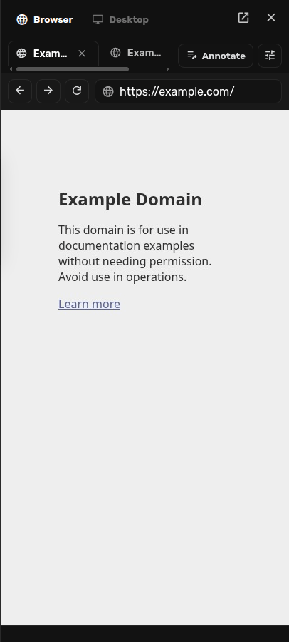
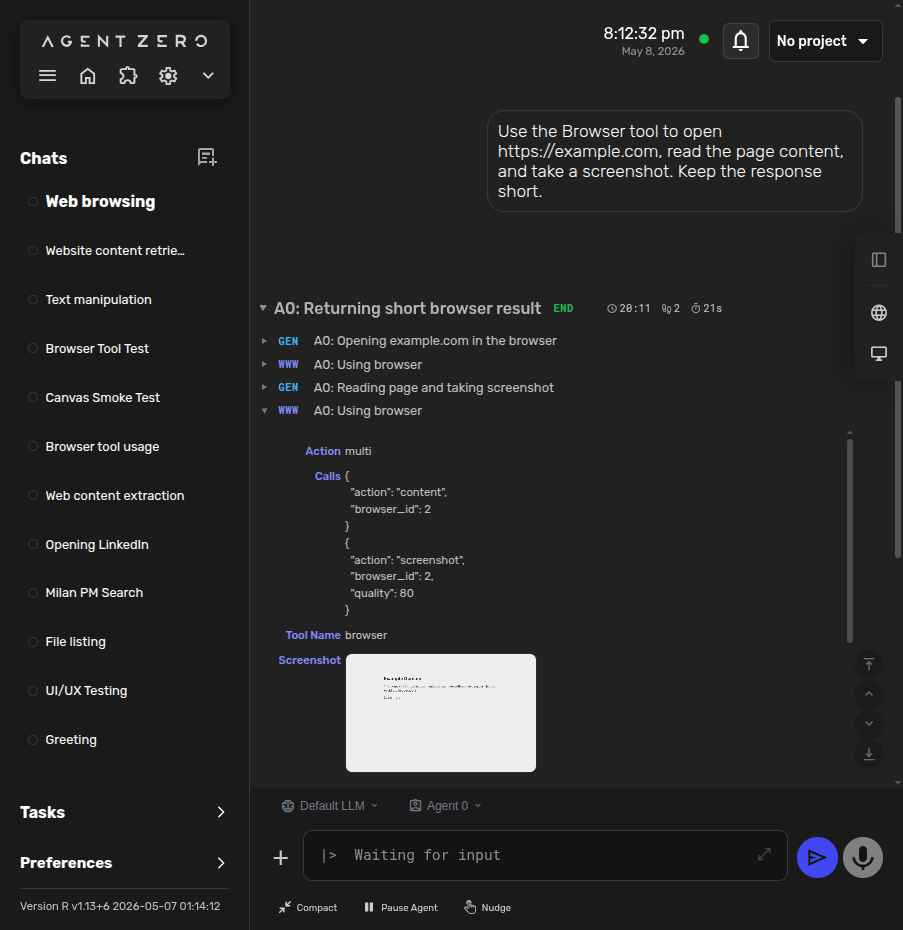
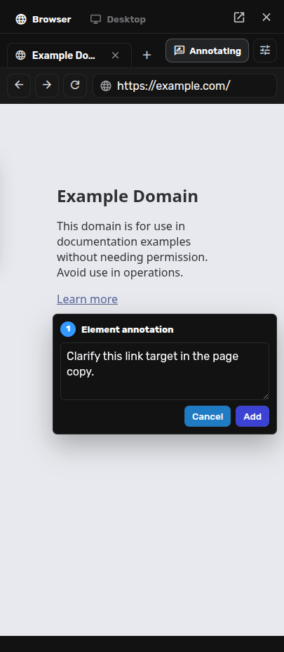
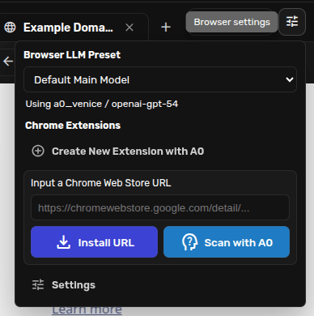
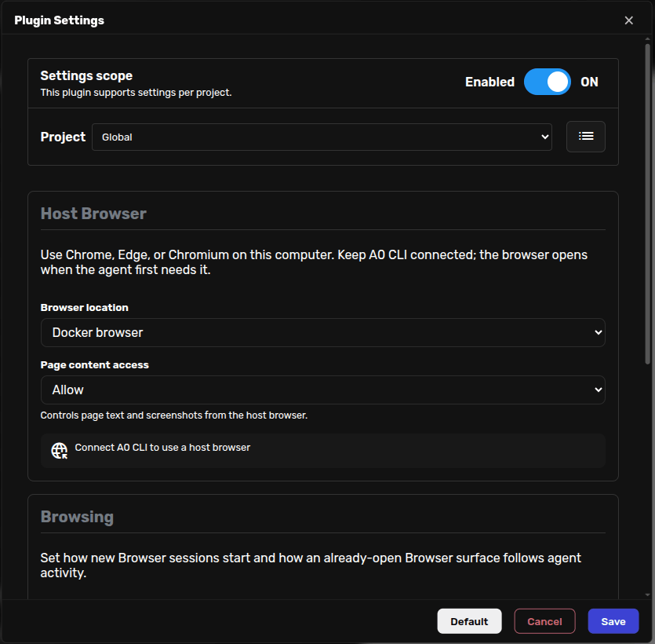

# Browser Guide

Agent Zero has a built-in Browser for real web pages.

Use it for research, forms, screenshots, UI review, downloads, extensions, and
anything else that works best in a browser.


## Two Parts

The Browser has two connected parts:

- **The Browser tool:** the agent can browse even when the Browser surface is not open.
- **The Browser surface:** The right-side Canvas panel where you can watch and interact with the live Docker browser.

The Browser surface does not open automatically every time the agent browses.
Open it when you want to watch, steer, or annotate the page.

## Open The Browser Surface

1. Open the right-side Canvas.
2. Select **Browser**.
3. Click **Open Browser** or the plus button to create a new browser tab.
4. Enter a URL in the Browser address bar.



The surface shows Browser tabs, back/forward/reload controls, an address bar, an annotation toggle, and Browser settings.

## Ask The Agent To Browse

You can ask naturally:

```text
Use the Browser tool to open https://example.com, read the page content, and take a screenshot. Keep the response short.
```

The agent can:

- open pages;
- read page content;
- click links and buttons;
- type into forms;
- upload files;
- take screenshots.

When a page is read, Agent Zero gets simple references such as `[link 1]`,
`[button 2]`, or `[input text 3]`. It can use those references to act on the
right part of the page.

<details>
<summary>Advanced Browser actions</summary>

```text
list
state
set_active
navigate
back
forward
reload
hover
double_click
right_click
drag
scroll
evaluate
key_chord
mouse
wheel
keyboard
clipboard
set_viewport
multi
close
close_all
```

</details>



## Screenshots And History

When Agent Zero takes a Browser screenshot, the image is saved and shown in the
chat history.

Many Browser steps also keep a small history screenshot. That means an older
chat can show the page as it looked when the agent worked on it, not just the
latest page frame.

## Annotate Pages

Annotate mode lets you mark a page element or region and send a targeted comment back into the chat. This is useful for UI review: you can point at the exact thing that needs to change instead of describing it from memory.

1. Open the Browser surface.
2. Navigate to the page you want to review.
3. Click **Annotate**. The button changes to **Annotating**.
4. Click the page element or region.
5. Write the comment and click **Add**.



## Browser Settings

Open Browser settings from the Browser toolbar or from the Browser plugin settings.



The toolbar menu includes:

- **Browser LLM Preset:** Optional model choice for Browser helper work.
- **Chrome Extensions:** Install a Chrome Web Store URL, create a new extension with Agent Zero, or scan an extension with Agent Zero.
- **Settings:** Opens the full Browser plugin settings.



The full settings include:

- **Browser location:** Use the Docker browser or **Bring Your Own Browser** through A0 CLI.
- **Page content access:** Controls host-browser page text and screenshots.
- **Starting page:** The default URL for new Browser sessions.
- **Autofocus active page:** Lets an already-open Browser surface follow the agent's browsing.
- **Extensions:** Choose which installed Chrome extensions load in the Docker browser.

## Docker Browser

The Docker browser is the default. It is a separate browser inside Agent Zero's
Docker environment, and it is the browser shown in the live Browser surface.

Use Docker browser mode when you want a clean, separate browser that Agent Zero
can show in the Canvas.

In normal Docker installs, the needed browser is already included. In local
development, Agent Zero can install it the first time it is needed.

## Bring Your Own Browser

Bring Your Own Browser lets Agent Zero use Chrome, Edge, or Chromium on your own
computer through A0 CLI.

Use it when the page, login, or browser profile should stay on your machine.

Requirements:

- [ ] Keep A0 CLI connected to the Agent Zero chat.
- [ ] Choose **Bring Your Own Browser** in Browser settings.
- [ ] Use Chrome, Edge, or Chromium on the host.
- [ ] For personal Chrome remote debugging, open the host browser first, go to `chrome://inspect/#remote-debugging`, and enable **Allow remote debugging for this browser instance**.


The first time Agent Zero tries to operate that browser, Chrome shows an **Allow
remote debugging?** prompt. Click **Allow** if you trust the connected Agent Zero
instance and A0 CLI session.


> [!IMPORTANT]
> Remote debugging grants full control of that browser session, including access
> to saved data, cookies, site data, and navigation. Enable it only for browser
> instances you intend Agent Zero to control.

Browser settings decide what Agent Zero may do with page text and screenshots
from your own browser:

- **Local models only:** Block host-browser content and screenshots unless the active chat model is local.
- **Warn when using cloud:** Allow content and include a warning.
- **Allow:** Allow without warning.

> [!NOTE]
> The live Browser surface shows the Docker browser. When Agent Zero uses your
> host browser, page results and screenshots appear in the chat, but the live
> Canvas is not a stream of your personal browser window.

For setup details, profiles, and troubleshooting, see the [A0 CLI Connector guide](a0-cli-connector.md#host-browser).

## Chrome Extensions

Browser can load Chrome extensions into the Docker browser.

Only enable extensions you trust. They run inside the Docker browser, but they
can still change what happens in that browser.

## MCP Alternatives

Start with Agent Zero's built-in Browser.

Use an MCP browser option only when you specifically need another browser tool
or an external automation service.

Common alternatives include:

- Chrome DevTools MCP
- Playwright MCP
- Browser OS MCP

See [MCP Setup](mcp-setup.md) for MCP setup.

## Troubleshooting

- **Browser says Playwright is missing:** Docker installs already include the browser. In local development, let Agent Zero install it on first use or preinstall it with `PLAYWRIGHT_BROWSERS_PATH=tmp/playwright playwright install chromium`.
- **The Browser surface does not open automatically:** That is expected. Open the Browser surface manually or ask the agent to show it.
- **The Canvas does not follow the agent:** Enable **Autofocus active page** in Browser settings.
- **Bring Your Own Browser cannot start:** Keep A0 CLI connected, verify Browser location is **Bring Your Own Browser**, and check `/browser status` in A0 CLI.
- **Host-browser content is blocked:** Switch to a local model or change Browser **Page content access** from **Local models only** to **Warn when using cloud** or **Allow**.

## Related

- [A0 CLI Connector](a0-cli-connector.md): host Browser setup, profiles, and CLI commands.
- [MCP Setup](mcp-setup.md): external browser tools when you need a different setup.
- [Desktop Guide](desktop.md): Linux GUI apps and LibreOffice Cowork in the Canvas.
