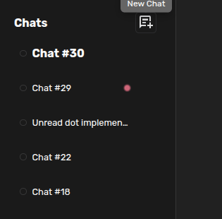

# Create A Small Plugin

The fastest way to understand Agent Zero plugins is to make one small enough to
hold in your head.

This guide walks through a real example: a local plugin named `unread_dot` that
adds a pulsing dot beside a chat when that chat receives new activity while you
are looking somewhere else.



For architecture and source-linked internals, use
[DeepWiki for Agent Zero](https://deepwiki.com/agent0ai/agent-zero). This page
stays practical: what to ask, where files appear, what to check, and how to know
the plugin actually works.

## What You Are Making

`unread_dot` is intentionally tiny:

- it does not add a server endpoint;
- it adds no tool;
- it installs no package;
- it makes no network calls;
- it touches only the Web UI and one browser `localStorage` key.

That makes it a good first plugin. You can see the whole shape without learning
every plugin feature at once.

## Ask Agent Zero To Build It

Open a new chat and give Agent Zero a very specific plugin task:

```text
Use the a0-create-plugin skill.

Create a local-only plugin named unread_dot in /a0/usr/plugins/unread_dot.
The plugin should show a pulsing dot in the chat list whenever a non-selected
chat receives new agent activity.

Keep it minimal and frontend-only:
- no external dependencies;
- no backend API;
- no tools;
- no network calls.

If the plugin already exists, improve it instead of creating a duplicate.
When finished, run the a0-review-plugin skill on unread_dot and summarize
PASS/WARN/FAIL. Do not run CodeRabbit.
```

The important part is not the exact wording. The important part is giving Agent
Zero the plugin name, the location, the visible behavior, and the boundaries.

## Where The Files Go

Local plugins live under `/a0/usr/plugins/<plugin_name>/` inside the running
Agent Zero instance. For this example, the final plugin shape is:

```text
/a0/usr/plugins/unread_dot/
├── plugin.yaml
├── README.md
├── extensions/
│   └── webui/
│       ├── apply_snapshot_before/
│       │   └── track-unread.js
│       └── initFw_end/
│           └── bootstrap-unread-dot.js
└── webui/
    ├── unread-dot.css
    └── unread-dot-store.js
```

`plugin.yaml` is the plugin's name tag:

```yaml
name: unread_dot
title: Unread Dot
description: Shows a pulsing dot beside chats that received new activity while you were elsewhere.
version: 1.0.0
settings_sections: []
per_project_config: false
per_agent_config: false
```

The two Web UI extension files are the little doorways into the running
interface:

- `initFw_end/bootstrap-unread-dot.js` loads the store and stylesheet after the Web UI starts.
- `apply_snapshot_before/track-unread.js` watches state snapshots so the plugin can notice when another chat changes.

The store keeps the unread state. The CSS draws the dot.

## Try It For Real

After creating or changing a plugin, restart Agent Zero so the Web UI extension
list is rebuilt.

Then test the behavior:

1. Open a fresh chat.
2. Send a short prompt, such as:

   ```text
   Please reply with one short sentence: unread dot live test complete.
   ```

3. Immediately switch to another chat.
4. Wait for Agent Zero to keep working in the first chat.
5. Look at the chat list.

If the first chat receives new activity while it is not selected, the dot appears.
When you open that chat again, the dot clears.

This example watches for chat activity. In normal use, that means "the agent did
something in a chat you were not watching." It does not read every message in
every other chat.

## Review It

Run the plugin review skill before treating the plugin as done:

```text
Use the a0-review-plugin skill to review /a0/usr/plugins/unread_dot.
Report PASS/WARN/FAIL by phase.
```

For this example, the review result is:

| Phase | Result | Notes |
| --- | --- | --- |
| Manifest | PASS | `plugin.yaml` is valid, named correctly, and uses simple local settings. |
| Structure | PASS with WARN | The layout is standard. `LICENSE` is absent, which is fine locally but blocks Plugin Index submission. |
| Code patterns | PASS with WARN | The store uses Agent Zero's `createStore` pattern. The unread signal is chat activity, not a parsed message-author check. |
| Security and index | PASS with WARN | No secrets, subprocesses, dependencies, or outbound calls. The community index already has a related `Chat Status Marklet` plugin, so treat this as a learning example unless you make it clearly different. |

Status: ready as a local demo plugin. Not ready as a new community submission
until it has a license and a reason to exist separately from similar plugins.

## Make The Example Yours

Once the small version works, change only one thing at a time:

- move the dot to a different place in the row;
- use a badge instead of a dot;
- add a plugin setting for color or animation;
- show a different status for running chats and finished chats;
- turn the plugin into a publishable project with a `LICENSE`, screenshots, and a clearer README.

Small plugins are good teachers. You can see the whole machine turning without
standing inside the engine.

## Related

- [Usage Guide](usage.md#plugins-and-plugin-hub): where plugins appear in the Web UI.
- [DeepWiki for Agent Zero](https://deepwiki.com/agent0ai/agent-zero): source-linked architecture when you need it.
- [Contributing Guide](contribution.md): expectations before sharing changes upstream.
