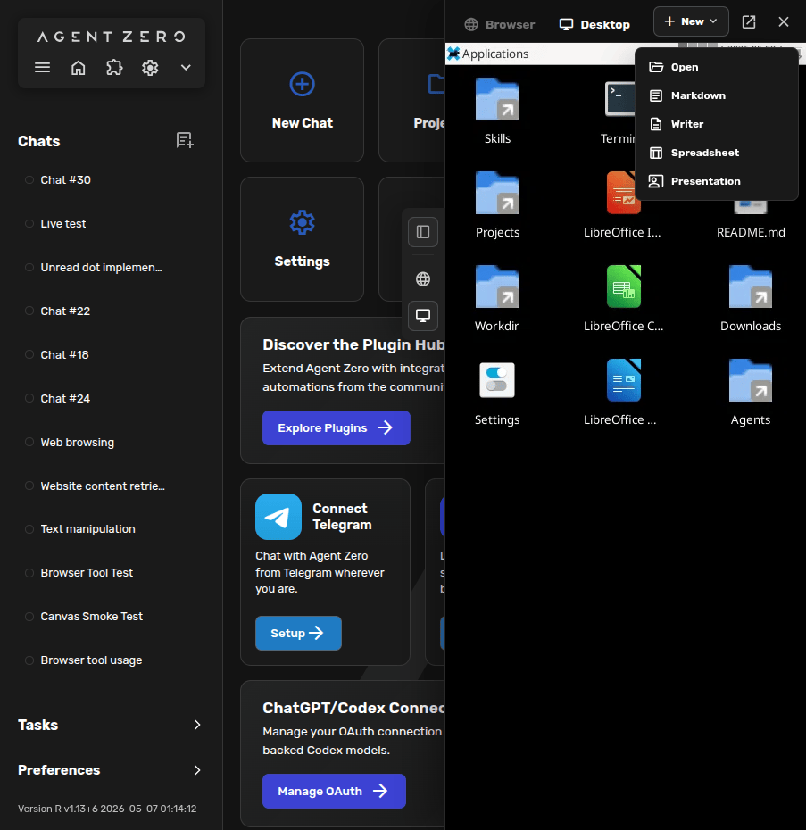
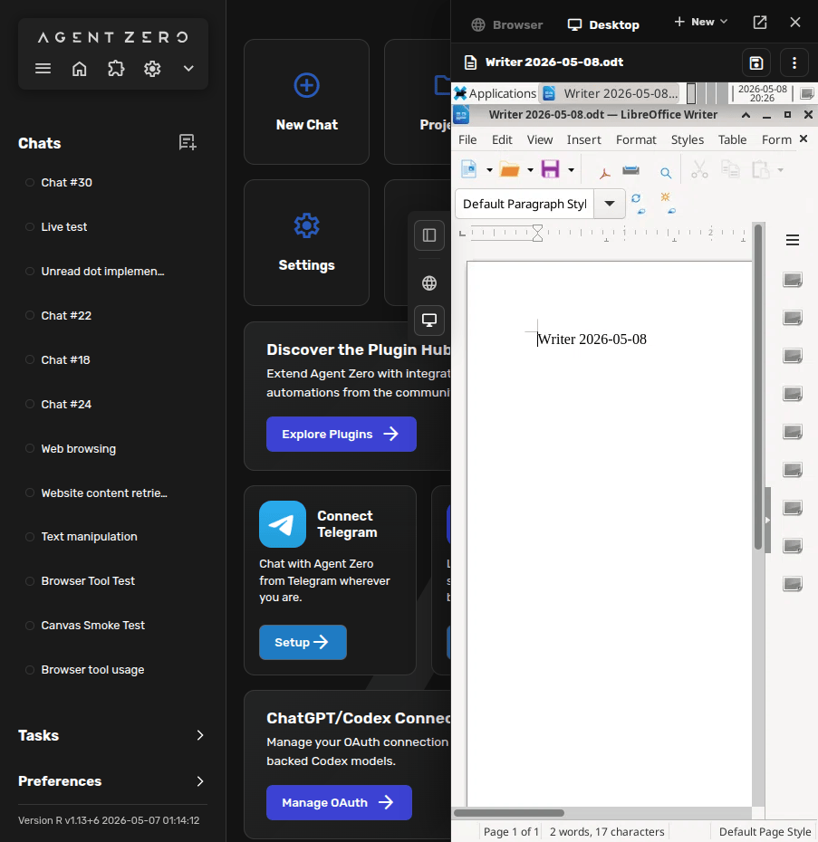

# Desktop Guide

Agent Zero has its own Linux desktop inside the right-side Canvas.

Open it by clicking the **Desktop** icon in the Canvas rail. The surface starts
an XFCE desktop that Agent Zero can also control when a task needs a real GUI.


Use the Desktop when the work is visual: opening Linux apps, inspecting files in
a file manager, checking a document layout, or LibreOffice Cowork.

For architecture and source-linked internals, use
[DeepWiki for Agent Zero](https://deepwiki.com/agent0ai/agent-zero). This page
is the practical tour.

## What The Desktop Is For

The Desktop is a live Linux workspace. You can use it yourself, and Agent Zero
can use its Linux Desktop skill to observe the screen, act through the GUI, and
verify what changed.

Good uses:

- open the graphical file manager for `Workdir`, `Projects`, `Skills`, `Agents`, or `Downloads`;
- run Linux GUI apps that are available in the Agent Zero environment;
- open a terminal when a visual terminal session is useful;
- inspect or polish LibreOffice Writer, Calc, and Impress files;
- Cowork with the agent in a document, spreadsheet, or presentation.

For normal web browsing, use the **Browser** surface instead of launching a
browser inside the Desktop. The Browser surface has dedicated page inspection,
screenshots, history, annotations, and host-browser support.

## Start From The Canvas

The Desktop lives next to the Browser surface in the Canvas.

1. Open Agent Zero.
2. Click the **Desktop** icon on the right Canvas rail.
3. Wait for the desktop to finish starting.
4. Click **Open as window** if you want more room.

The first start after an update can take longer while the Desktop gets ready.
After that, it normally opens much faster.

## Create Or Open Files

The Desktop toolbar has a **New** menu.



Use it to create:

- **Markdown** for notes, drafts, and simple documents;
- **Writer** for LibreOffice text documents;
- **Spreadsheet** for LibreOffice Calc workbooks;
- **Presentation** for LibreOffice Impress decks.

Use **Open** when you already have a file in the Agent Zero workspace.

Agent Zero usually creates document files through its document tools first, then
lets you open them in the Desktop when you want to inspect or polish them. That
keeps content changes reliable while still giving you the full GUI when it
matters.

## Cowork In LibreOffice

LibreOffice Writer, Calc, and Impress run inside the Desktop.



You can type directly in the app, save, rename, and close the file from the
Canvas header. Agent Zero can also work with the same file: it can create the
first draft, update cells, revise slides, or use the visible Desktop to check
layout before reporting back.

Good prompts:

```text
Create a Writer document for this meeting note and open it in Desktop so I can edit with you.
```

```text
Open this spreadsheet in Calc, add a small summary table, save it, and show me the result in Desktop.
```

```text
Create a short Impress deck, then use Desktop to check that the slides look clean.
```

For default formats, think:

- Writer -> ODT;
- Calc -> ODS;
- Impress -> ODP.

Ask for DOCX, XLSX, or PPTX only when you need Microsoft Office compatibility.

## How Agent Zero Uses It

When you ask for Desktop work, Agent Zero uses a careful loop:

1. create or edit the file in the most reliable way;
2. open the Desktop only when the GUI is useful;
3. observe the visible state;
4. act through the app when needed;
5. save and verify the result.

This means the Desktop is not just a remote screen. It is a shared workspace
where the agent can do GUI work and you can take over at any time.

## Practical Tips

- Use **Open as window** for large Writer, Calc, or Impress sessions.
- Save before closing if you edited by hand.
- Use Markdown for quick notes and drafts unless you need a LibreOffice file.
- Use Writer, Calc, or Impress when layout, formulas, charts, or slide polish matter.
- If a GUI app feels stuck, ask Agent Zero to verify the Desktop state before continuing.
- Keep the Browser surface for websites and the Desktop surface for Linux apps.

## Related

- [Browser Guide](browser.md): web pages, screenshots, annotations, and host-browser mode.
- [Memory Guide](memory.md): what to check when behavior keeps repeating in an unwanted way.
- [Usage Guide](usage.md): the main Web UI workflows in one guided tour.
