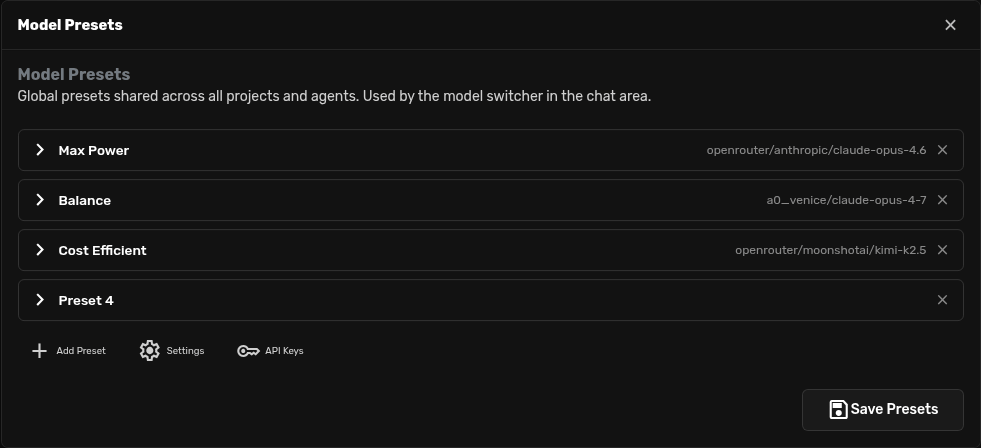

# Model Presets

Model Presets are named shortcuts for model choices.

Use them when you want to switch a chat between setups such as "fast", "cheap",
"local", "balanced", or "maximum power" without rebuilding the settings each
time.

## Choose A Preset

The preset menu is the first dropdown on the left side of the chat status bar.

1. Open a chat.
2. Click the current preset name.
3. Choose the preset you want.

The selected preset affects the current chat.

## Edit Presets

Click **Edit presets** from the same menu.

From this screen you can:

- rename presets;
- choose the main model;
- choose the utility model;
- open API key settings;
- save the preset list.

Think of a preset as a label on a model setup.

| Field | Simple meaning |
| --- | --- |
| **Main model** | The model that does the main conversation and reasoning. |
| **Utility model** | A smaller helper model for lighter internal tasks. |

## Add A Preset

Click **Add Preset**, give it a name, choose models, then click **Save Presets**.

Good preset names are easy to spot quickly:

- `Max Power`
- `Balanced`
- `Fast Cheap`
- `Local Private`
- `GPT-5 Mini`
- `Claude Opus`
- `Kimi Budget`

Some people prefer names based on purpose. Others prefer names that look like
the model they use most. Both are fine. The important thing is that your eyes
can find the right option quickly.

## A Simple Starting Set

If you are not sure what to create, start with three presets:

| Preset | Use it for |
| --- | --- |
| **Best** | Hard work where quality matters more than cost or speed. |
| **Balanced** | Everyday chats, coding, writing, and research. |
| **Cheap** | Simple tasks, quick drafts, summaries, and tests. |

You can always rename them later.

## How Presets Fit With Other Controls

| Control | What it changes |
| --- | --- |
| **Model Preset** | Which models power the chat. |
| **Agent Profile** | The agent's role, tone, and prompt behavior. |
| **Project** | Workspace, files, memory, secrets, and project instructions. |
| **Skill** | A specific procedure added to prompt extras. |

For example, you can use the same "Researcher" Agent Profile with a cheaper
preset for simple questions and a stronger preset for difficult investigations.
