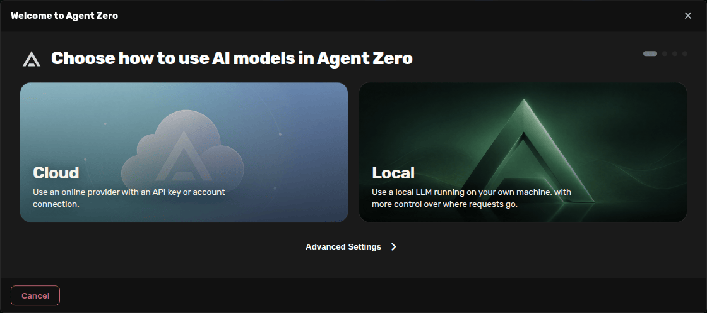
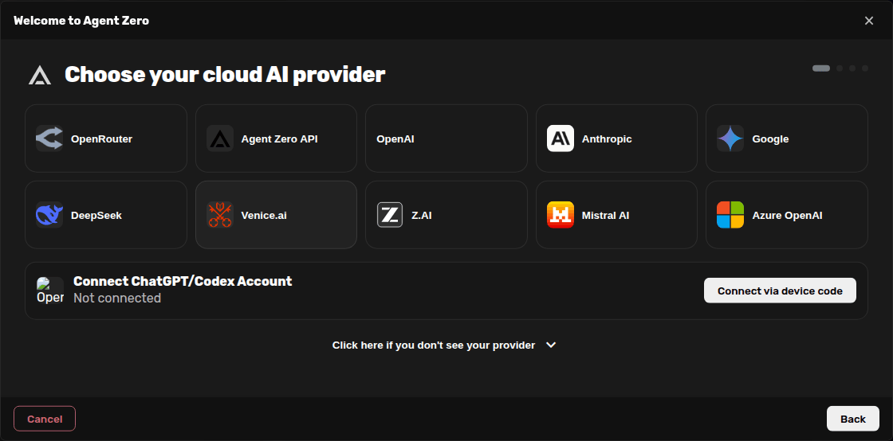
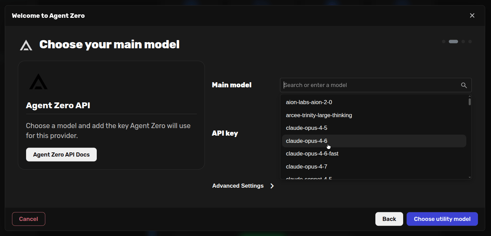
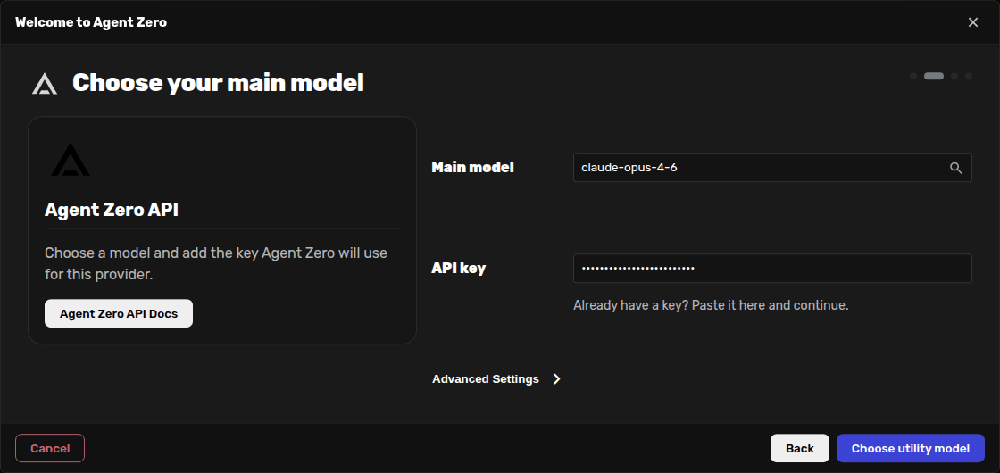
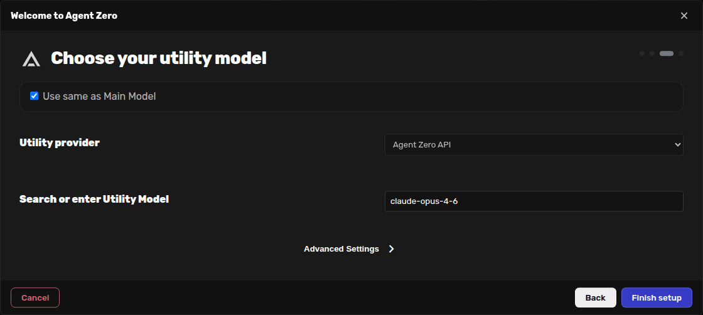
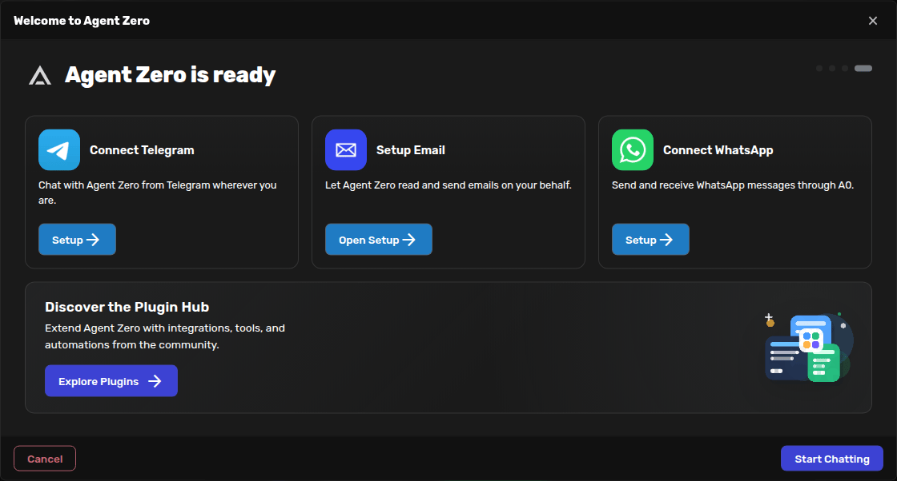

# First-Run Onboarding

Use onboarding the first time you open Agent Zero, or any time the Web UI says
your models still need setup. The wizard helps you pick a provider, add the
needed key or connection, choose the main model, choose the utility model, and
start chatting.

This example uses **Agent Zero API** with a fake demo key and
`claude-opus-4-6`. Replace the demo key with your own key.

## Choose Cloud Or Local

Open the Web UI and click **Start Onboarding** from the welcome banner. On the
first screen, choose whether Agent Zero should use a hosted provider or a local
model server.

Choose **Cloud** when you want to use Agent Zero API, OpenRouter, Anthropic,
OpenAI, Google, Venice, or another hosted provider. Choose **Local** when you
want to connect to Ollama, LM Studio, or another model server running on your
machine.

## Pick Agent Zero API

On the Cloud provider screen, click **Agent Zero API**.

The ChatGPT/Codex account option is also available on this Cloud screen if you
want to connect by device code instead of pasting a provider key.

## Add The Key And Main Model

Paste your Agent Zero API key in **API key**. The screenshot uses a fake example
key, and the field is masked.

Click the magnifier in **Main model** to open the model list, then choose
`claude-opus-4-6`.

After the model is selected, click **Choose utility model**.

## Choose The Utility Model

The utility model handles supporting work such as summarizing, organizing
memory, and other background tasks.

Leave **Use same as Main Model** checked if you want both roles to use
`claude-opus-4-6`.

You can also uncheck **Use same as Main Model** and choose a different utility
provider and model. For example, you might keep a strong main model for chat and
use a faster or cheaper model for utility tasks.

Click **Finish setup** when the utility model looks right.

## Start Chatting

The ready screen confirms that model setup is done. Optional setup cards may
appear for integrations such as Telegram, Email, WhatsApp, or plugins.

Click **Start Chatting** to create a chat and begin using Agent Zero.

> [!IMPORTANT]
> Do not reuse the fake key shown in this guide. Paste your own provider key,
> and do not share screenshots that reveal real keys or private account details.
