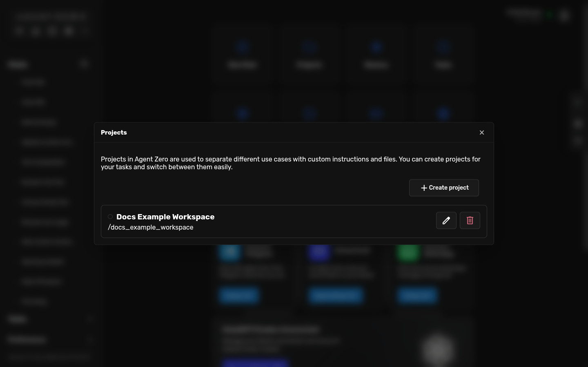
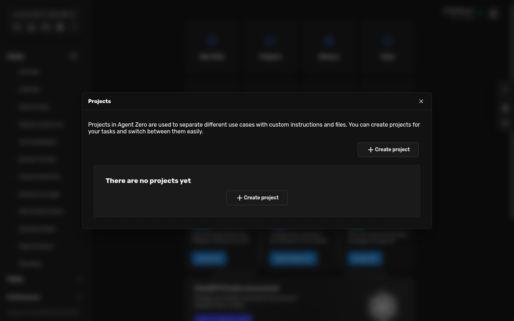
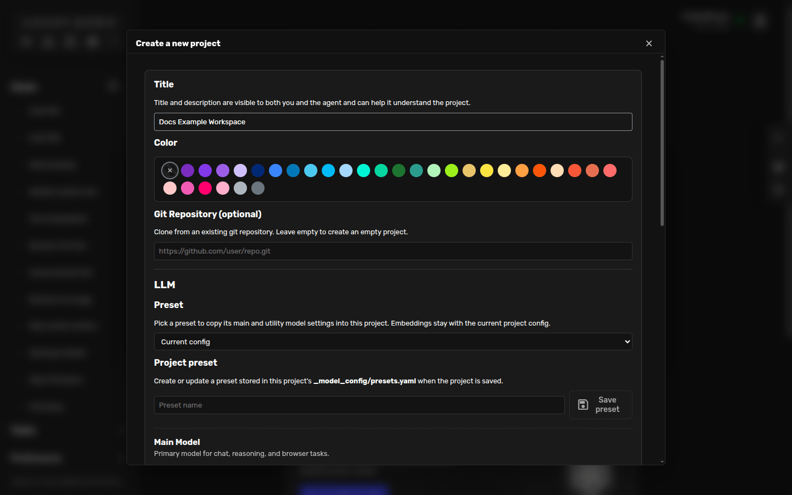
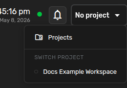

# Projects

Projects tell Agent Zero what world it is working in.

Use a project when you want a chat to have its own purpose, instructions, files,
memory, secrets, and model choices. A project can be a client, a codebase, a
research topic, a recurring workflow, or any other focused workspace.



## When To Use One

Create a project when you want Agent Zero to remember context that should not
leak into every other chat.

Good project examples:

- A Git repository you want Agent Zero to work on.
- A client workspace with its own tone, files, and credentials.
- A research topic with its own sources and notes.
- A recurring report that always follows the same steps.
- A documentation workspace with a clear writing style.

Stay in a normal chat when the task is quick, disposable, or unrelated to a
larger body of work.

## Open Projects

From the dashboard, click **Projects**.


If you have no projects yet, the list starts empty and offers **Create
project**.



## Create A Project

Click **Create project** and give it a clear title. The title is what you will
recognize later in the project picker.



For a simple project, the title is enough. If you want Agent Zero to clone a
repository into the project, paste the Git URL in **Git Repository** before you
continue.

After creating the project, Agent Zero opens the edit screen.

## Write Helpful Instructions

The most important part of a project is the **Instructions** field.

Description answers: "What is this project?"

Instructions answer: "How should Agent Zero behave when this project is active?"


Good instructions are usually short and specific. Tell Agent Zero:

- what the project is for,
- what style of answer you want,
- where files should be read or written,
- what quality rules matter,
- when it should ask before acting.

Example:

```markdown
You are working inside the Docs Example Workspace.

Use this project for small documentation examples and user-facing guidance.

When this project is active:
- Explain steps in plain language before technical detail.
- Prefer screenshots, checklists, and concrete examples.
- Keep generated files inside this project unless I ask otherwise.
- Ask before using credentials, private data, or external accounts.
- When editing docs, focus on what the user sees and what they should do next.
```

That is enough. A project prompt does not need to be a constitution. Start small,
then improve it when you notice what the agent should do differently.

## Activate A Project

Open or create a chat. In the top-right corner, click the project picker. It may
say **No project** if the chat is not attached to a project yet.



Choose your project.


When the project name appears in the top bar, the chat is now using that
project. Agent Zero will use the project instructions and work with the project
workspace for that chat.

Each chat can use a different project. This lets you keep a client chat, a code
chat, and a research chat separate at the same time.

## What Changes After Activation

When a project is active, Agent Zero can use:

- the project instructions,
- files stored in the project workspace,
- project memory,
- project variables and secrets,
- project-specific model settings when configured.

Try prompts like:

```text
Read the project instructions and tell me how you will work in this workspace.
```

```text
Create a short README for this project based on its current files.
```

```text
Use this project as the home for our weekly research notes.
```

## Git Projects

If you paste a Git repository URL while creating the project, Agent Zero clones
that repository into the project workspace.


Use Git projects when you want Agent Zero to work on a real codebase with the
right local files, branch state, and project instructions.

For private repositories, use a token when the UI asks for one. Do not paste
tokens into chat messages.

## Variables And Secrets

Projects can store values that only make sense inside that workspace.

Use **variables** for non-sensitive settings, such as:

```text
REPORT_FORMAT=markdown
DEFAULT_REGION=eu-west
```

Use **secrets** for credentials, such as API keys and passwords. Refer to them by
name in chat:

```text
Use the project GITHUB_TOKEN to check the repository status.
```

Keep your own copy of important secrets. Backups may not include every secret.

## Keep Projects Tidy

A good project stays useful because it stays focused.

- Use a clear title.
- Keep instructions short enough to read.
- Store files where the project expects them.
- Keep secrets scoped to the project that needs them.
- Update instructions when your workflow changes.
- Create a new project when the work belongs to a different client, codebase, or topic.

## Common Problems

**Agent Zero ignores the project.**
Check the top-right project picker. The project name must be visible in the
active chat.

**The project instructions are wrong or stale.**
Open **Projects**, click the edit icon, update the instructions, and save.

**A Git repository did not clone.**
Check the URL, authentication token, and network access. For private repos,
create a fresh token and try again.

**Secrets are not being used.**
Make sure the secret is saved in the project and refer to it by exact name.

**The project has become too broad.**
Split it. Projects work best when each one has a clear job.

## Related

- [Usage Guide](usage.md)
- [Browser Guide](browser.md)
- [A0 CLI Connector](a0-cli-connector.md)
- [DeepWiki for Agent Zero](https://deepwiki.com/agent0ai/agent-zero)
