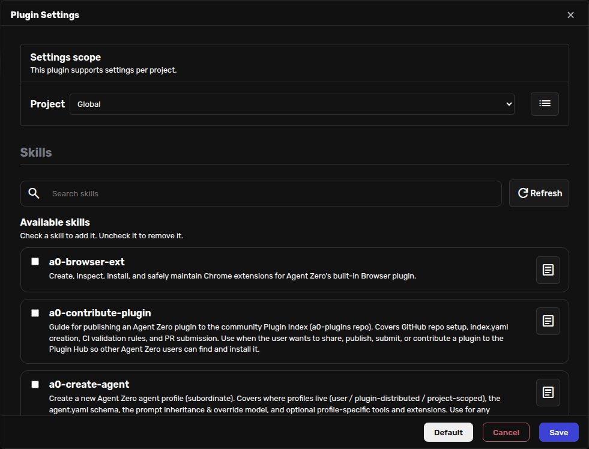

# Skills

Skills are focused instructions Agent Zero can load when a task needs them.

Most of the time, you do not need to think about skills. Ask for the work you
want, and Agent Zero can load a matching skill on demand.

You can also pin a skill yourself from the chat input when you want it to stay
active for the current conversation.

## Open The Skills Selector

1. Open a chat.
2. Click the **+** button in the chat input area.
3. Click **Skills**.

The selector opens with a searchable list of skills.

## Add Or Remove A Skill

Click a skill to add it. Active skills are shown at the top of the selector.

To remove a skill, use the remove button in **Active skills** or uncheck it in
the list.

Active skills are added to the **Extras** part of the system prompt. That means
Agent Zero sees them every turn while they are active.

> [!TIP]
> Keep this list short. Pin the skills you really want present all the time, and
> let Agent Zero load the rest only when it needs them.

## When To Pin A Skill

Pin a skill when the current chat should keep following the same special
procedure.

Good examples:

- creating an Agent Profile;
- reviewing a plugin;
- following a writing format;
- working with a repeated data-cleaning recipe;
- keeping a project-specific checklist visible during a long chat.

Do not pin a skill just because it might be useful someday. A lighter prompt is
usually easier for the agent to follow.

## Skills, Profiles, And Projects

| Control | What it changes |
| --- | --- |
| **Skills** | Adds a specific procedure to the current prompt extras. |
| **Agent Profiles** | Changes the broader role and behavior of the chat. |
| **Projects** | Adds workspace, files, memory, secrets, and project instructions. |

If Agent Zero starts following an old procedure you no longer want, open the
Skills selector and remove any active skill that does not belong in the chat.

## Creating Skills

This page is about using skills in the Web UI.

If you want to write or contribute a skill, see
[Contributing Skills](../developer/contributing-skills.md).
