# Usage Guide

This guide is the practical tour of Agent Zero after installation. It explains
what you can do in the Web UI, what to try first, and where to go when you want
the deeper source-linked explanation.

For architecture, backend flow, Web UI internals, plugin lifecycle, and API
details, use [DeepWiki for Agent Zero](https://deepwiki.com/agent0ai/agent-zero).


## Basic Operations

Agent Zero is built around a chat, a working Linux environment, and a Web UI that
lets you watch and steer the work.

Common places to start:

- **New Chat:** start a clean conversation.
- **Projects:** give a chat its own workspace, files, memory, secrets, and instructions.
- **Memory:** review what Agent Zero has learned or imported.
- **Tasks:** create scheduled, planned, or manual automations.
- **Files:** open the Agent Zero file browser.
- **Settings:** configure models, credentials, preferences, plugins, and backup.
- **Browser:** open the live Browser surface when you want to watch browsing or annotate a page.
- **Desktop:** open the live Linux desktop when you want GUI apps, a terminal window, or LibreOffice Cowork.

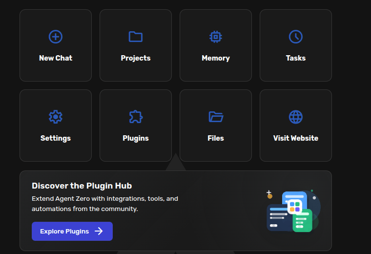

The chat input also has action buttons for attachments, pausing, nudging, compacting,
and opening helpful views such as context or history.


Use **Restart** from the sidebar when you need the framework to reload after
settings or code changes.

## Plugins And Plugin Hub

Plugins add integrations, tools, panels, and automation helpers.

Open **Plugins** from the dashboard or sidebar to see what is installed.


Use the **Browse** tab or **Install** button to open the Plugin Hub.


Before installing a plugin, read its description, README, permissions, and source
link. Treat plugins like any other code you run in your workspace: install the
ones you trust and remove what you do not use.

When you want to make your own first plugin, start with something small and
visible. The [Create a Small Plugin](create-plugin.md) guide walks through a
local Web UI plugin that adds an unread dot to the chat list and then reviews it
with `a0-review-plugin`.

## Skills, Agent Profiles, And Model Presets

The small controls around the chat input let you shape the current conversation
without opening the full Settings screen.

### Skills

Skills are focused instructions Agent Zero can load when it needs them. You can
also pin a skill manually for the current chat.

Click the **+** button in the chat input, then click **Skills**.

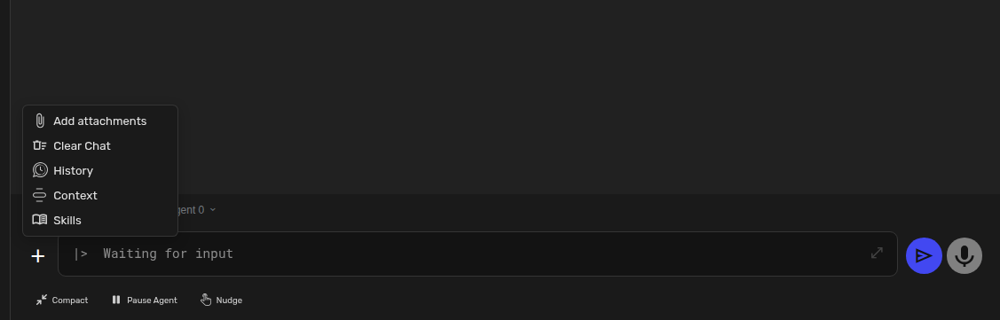

Use the selector to add or remove active skills.

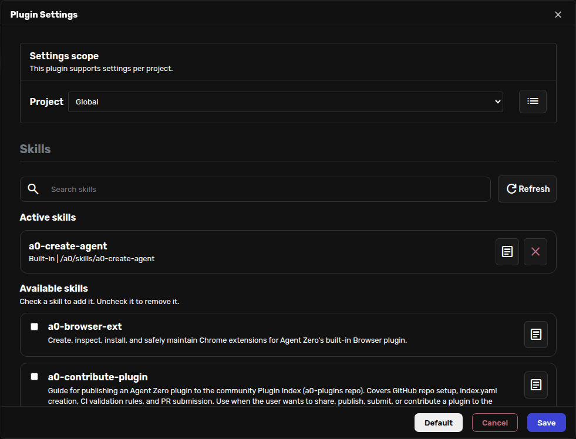

Active skills are added to the **Extras** part of the system prompt, so keep the
list short and intentional. See the [Skills guide](skills.md).

### Agent Profiles

Agent Profiles change the role, tone, and prompt instructions for the selected
chat.

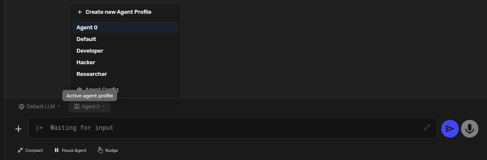

Use the profile menu near the chat input to switch the current chat. Use
**Settings -> Agent Config** when you want to change the default for new chats.

The same menu includes **Create new Agent Profile**. It places a ready-to-send
message in the input so Agent Zero can guide you through creating a new profile.

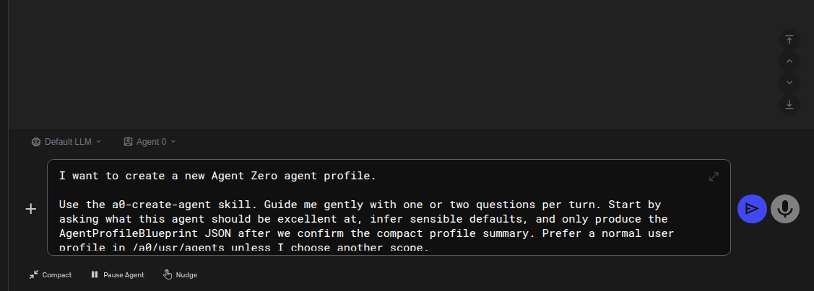

See the [Agent Profiles guide](agent-profiles.md).

### Model Presets

Model Presets are named shortcuts for model choices. Use them for setups like
`Best`, `Balanced`, `Fast Cheap`, or a model name you can spot quickly.

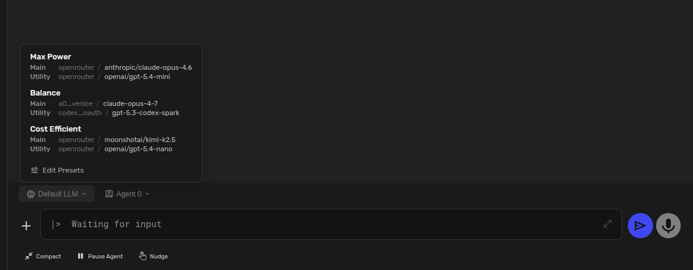

Click **Edit presets** when you want to add or rename presets.

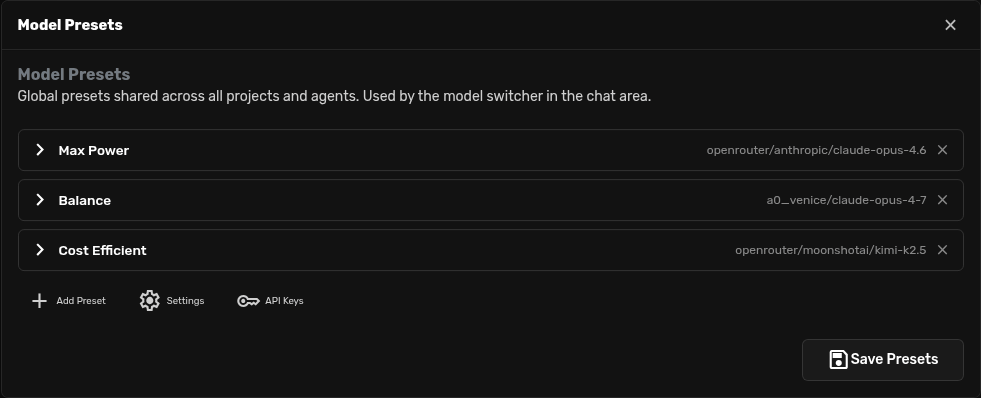

See the [Model Presets guide](model-presets.md).

## File Attachments

Attach files when the agent should read, summarize, transform, or organize them.


You can attach one file or several files, then describe what should happen:

```text
Read these PDFs and create a short comparison table.
```

```text
Move these files into a clean folder structure and explain what changed.
```

Attached files are visible in the chat input before you send the message, so you
can remove mistakes before Agent Zero starts working.

## Tool Usage

You usually do not need to name tools. Say what you want done and Agent Zero will
choose whether it needs the browser, code execution, files, knowledge, plugins,
or another available capability.

Good prompts are specific about the desired result:

```text
Research three deployment options for this app. Cite sources and finish with a recommendation.
```

```text
Open the attached CSV, find the main trend, and create a chart I can edit later.
```

```text
Inspect this repository and propose the safest first improvement before changing files.
```

When you do want internals, use
[DeepWiki for Agent Zero](https://deepwiki.com/agent0ai/agent-zero).

### Browser Tool And Surface

The Browser has two parts:

- the `browser` tool, which the agent can call directly;
- the visible Browser surface in the Canvas, where you can watch and annotate pages.

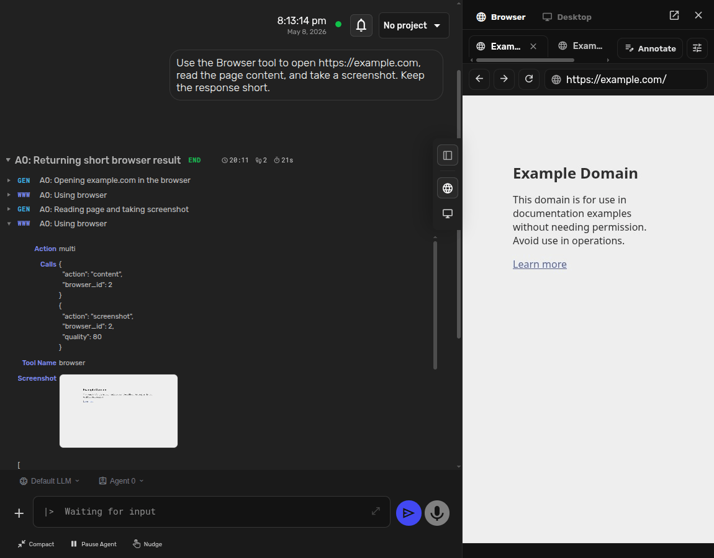

Ask naturally:

```text
Use the Browser tool to compare these pages and take screenshots of the important parts.
```

```text
Open my local app in the Browser. I will annotate the page, then you can fix the issues.
```

For screenshots, history, annotations, Docker browser mode, host-browser mode
through A0 CLI, privacy controls, and Chrome extensions, see the
[Browser Guide](browser.md).

External browser MCP tools are still useful for specialized setups. See
[MCP Setup](mcp-setup.md).

### Desktop Surface

The Desktop surface opens Agent Zero's own Linux desktop in the Canvas.
Use it when you want the agent to work visually with GUI apps, open a terminal,
or cowork with you in LibreOffice.

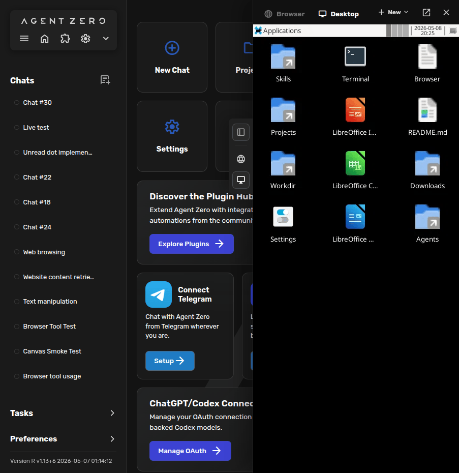

The **New** menu can create Markdown, Writer, Spreadsheet, and Presentation
files. Writer, Calc, and Impress run inside the Desktop, so you can edit by hand
while Agent Zero creates, updates, saves, and verifies the same files.

For the screenshot walkthrough and prompt examples, see the
[Desktop Guide](desktop.md).

### Agent-To-Agent Communication

Agent Zero instances can communicate through A2A when you want multiple
instances to collaborate.

Use A2A when you have a clear reason to split work across Agent Zero instances,
such as a specialist server, a remote machine, or a project-specific agent. See
[A2A Setup](a2a-setup.md).

### Multi-Agent Cooperation

Inside a single Agent Zero instance, the main agent can create subordinate agents
to investigate focused parts of a larger job.


This is useful for research, code review, comparison work, and tasks where one
agent should gather information while another keeps the main plan moving.

## Projects

Projects tell Agent Zero what world it is working in. Use one when a chat needs
its own files, instructions, memory, secrets, or model settings.

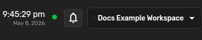

The simple flow:

1. Open **Projects** from the dashboard.
2. Click **Create project**.
3. Give it a clear title.
4. Add a short description.
5. Write practical instructions.
6. Save it.
7. Open a chat and choose the project from the top-right project picker.

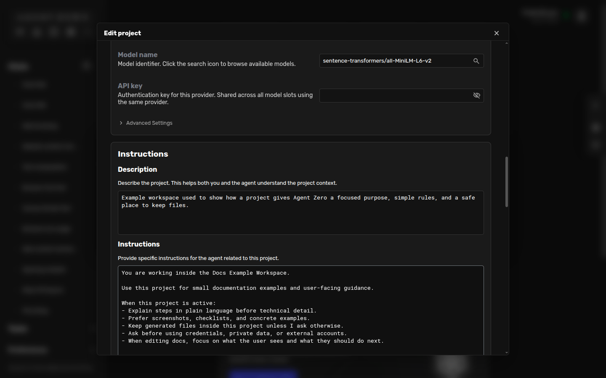

Good project instructions tell Agent Zero what should be different in that
workspace:

```markdown
When this project is active:
- Explain steps in plain language before technical detail.
- Prefer screenshots, checklists, and concrete examples.
- Keep generated files inside this project unless I ask otherwise.
- Ask before using credentials, private data, or external accounts.
```

Use projects for client work, code repositories, research topics, recurring
reports, and any workflow where context matters.

See the [Projects guide](projects.md) for the full screenshot walkthrough.

## Tasks And Scheduling

Tasks let Agent Zero run work later, repeatedly, or on demand.

Use tasks for:

- morning or weekly reports;
- monitoring a source and summarizing changes;
- recurring cleanup or export jobs;
- project-specific checks;
- manual batch jobs you want to run again.

Open **Tasks** from the dashboard or sidebar.


When creating a task, focus on four things:

- **Name:** what you will recognize later.
- **Type:** scheduled, planned, or ad-hoc.
- **Project:** optional, but recommended when the task needs specific context or secrets.
- **Prompt:** the actual work Agent Zero should perform.


Example:

```text
Name: Weekly docs review
Type: Scheduled
Project: Documentation
Prompt: Check the docs project for stale screenshots, broken links, and confusing sections. Summarize what needs attention.
```

Project-scoped tasks inherit project instructions, variables, secrets, files, and
memory. That means you can improve task behavior later by improving the project
instead of repeating every rule in every task.

## Secrets And Variables

Use **Secrets** for sensitive values such as API keys, tokens, passwords, and
credentials.

Use **Variables** for non-sensitive settings such as regions, URLs, usernames,
formats, or feature flags.

Refer to them by name in chat:

```text
Use the project GITHUB_TOKEN to check repository status.
```

Do not paste credentials into chat messages or public files. Keep your own copy
of important secrets because backups may not include every secret.

## Remote Access Via Tunneling

Tunnels let you reach your local Agent Zero instance from another device or
share it temporarily.

Before creating a tunnel:

- set UI authentication;
- understand that anyone with the tunnel URL can try to open your instance;
- stop the tunnel when you no longer need it.

Open **Settings -> External Services -> Flare Tunnel** to create or stop a tunnel.

## Voice Interface

Agent Zero supports text-to-speech and speech-to-text.

Use speech when you want to listen while doing something else, dictate a prompt,
or make the interface more accessible.


Speech-to-text settings live in Settings and include model size, language code,
silence threshold, and recording behavior.


## Mathematical Expressions

Agent Zero can render mathematical notation with KaTeX.


Ask for the format you want:

```text
Solve this step by step and show the final equations in KaTeX.
```

## File Browser

The File Browser lets you inspect and manage files inside the Agent Zero
environment.


Use it to:

- upload files;
- download generated work;
- create folders;
- rename or delete files;
- open editable text files;
- inspect the project or `/a0/usr` workspace.

For file-based work, prefer `/a0/usr` or a project workspace. Avoid storing
important work only in temporary directories.

## Memory Management

Memory is where Agent Zero keeps useful remembered information from conversations
and imported knowledge. It is powerful, but it is not magic. Long-term AI memory
still needs curation; this is not fully solved even by the largest AI labs and
companies.

Open **Memory** when you want to search, review, edit, copy, or remove stored
entries.


The controls let you choose a memory directory, filter by area, set a result
limit, search, adjust match threshold, and clear filtered results.

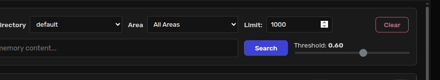

Use memory deliberately:

- keep durable facts and useful patterns;
- remove old test data;
- edit memories that became inaccurate;
- use project memory for project-specific context;
- create a backup before large cleanup.

If Agent Zero does something unexpected, repeats a wrong behavior, or seems to
remember the wrong thing, Memory is one of the first places to look. A stale or
incorrect memory can poison the processing instead of helping it.

Click a memory row to inspect its full content and metadata. From the detail
view you can copy, edit, or delete the entry.


For a practical cleanup checklist, see the [Memory Guide](memory.md).

## Backup And Restore

Backups protect your chats, projects, knowledge, memory, settings, skills, and
workspace files.

Create a backup before:

- major updates;
- plugin experiments;
- bulk memory cleanup;
- moving to a new machine;
- deleting or reorganizing important project files.

Open **Settings -> Backup & Restore** to create or restore a backup.

Secrets are sensitive and may not always be included in backup archives. Keep a
separate secure copy of credentials you depend on.

## Next Steps

- [Quick Start](../quickstart.md)
- [Projects guide](projects.md)
- [Browser guide](browser.md)
- [A0 CLI Connector](a0-cli-connector.md)
- [Skills guide](skills.md)
- [Agent Profiles guide](agent-profiles.md)
- [Model Presets guide](model-presets.md)
- [MCP Setup](mcp-setup.md)
- [Troubleshooting](troubleshooting.md)
- [DeepWiki for Agent Zero](https://deepwiki.com/agent0ai/agent-zero)
